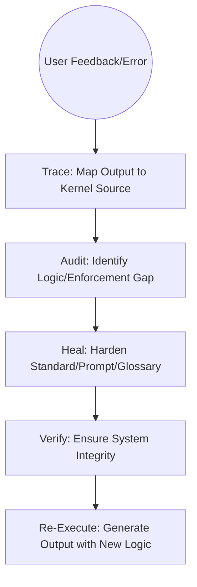

# System-First Remediation

## Context
When an AI agent fails, the traditional response is to fix the specific output. In the AI Kernel, we reject this "Patching" culture. This instruction mandates **Systemic Learning**: we trace every failure back to its root source in the Kernel, fix the "Factory," and only then re-generate the product.

## Architecture

## Steps

1. **Intake**: The **Operator** captures the user's feedback and the sub-optimal output snippet.
2. **Trace**: Flynn runs `trace-output-to-source.skill` to identify the active instructions, skills, and agents.
3. **Analyze**:
    - Identify if the error was caused by a vague **Standard**, a weak **Prompt**, or a missing **Glossary** constraint.
4. **Heal Kernel**:
    - **Vague Standard?** -> Add a new **Prohibited (U)** practice.
    - **Prompt Gap?** -> Update the relevant **Prompt** or **Skill** logic.
    - **Missing Constraint?** -> Add a **Usage Constraint** to the relevant Glossary entry.
5. **Verify Fix**: Run `maintain-kernel-integrity.instruction` (Meta-Audit) to ensure the fix hasn't introduced new violations.
6. **Re-Execute**: Once the kernel is hardened, the **Operator** re-runs the original user request using the updated logic.

## Postconditions
1. At least one Kernel node (Standard, Skill, Prompt, or Glossary) has been improved.
2. The original task has been re-executed with the updated logic.

## Quality Gate
- **Verification**: The remediation must update the "Governing Source" of the error.
- **Enforcement**: "Patching" a file without a corresponding kernel update is **Unacceptable (U)**.
