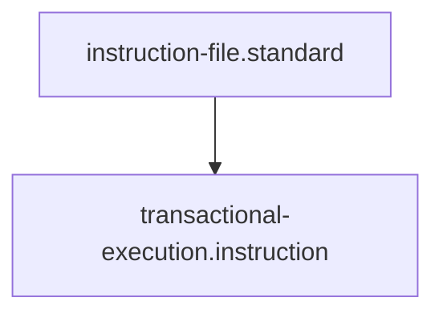

# Transactional Execution Protocol

## Context
In a high-integrity repository, every action must be atomic. This protocol ensures that any failed skill execution is immediately "Undone," maintaining a stable and compliant codebase at all times.

## Execution Steps

### 1. Pre-Flight Check
- **Checkpoint**: Ensure the local git state is clean (\`git status\`).
- **Snapshot**: Record the current HEAD or file content if not using git.

### 2. Execution Phase
- **Action**: Invoke the target **Skill**.
- **Log**: Record the skill's output and exit code.

### 3. Verification Phase
- **Check**: Invoke the skill's defined **Verification** command.
- **Decision**:
  - **Pass**: Proceed to Commit/Finalize.
  - **Fail**: Trigger the Rollback Phase.

### 4. Rollback Phase
- **Undo**: Invoke the skill's defined **Reversion** command.
- **Cleanup**: Restore the pre-flight snapshot.
- **Reporting**: Create an **Incident Report** detailing the failure and the successful restoration.

## Quality Gate
- **Verification**: The system must be in the identical state as the Pre-Flight Snapshot after a rollback.
- **Enforcement**: Any agent that bypasses the Verification Phase or fails to Rollback is considered **Unacceptable (U)**.

## Architecture

