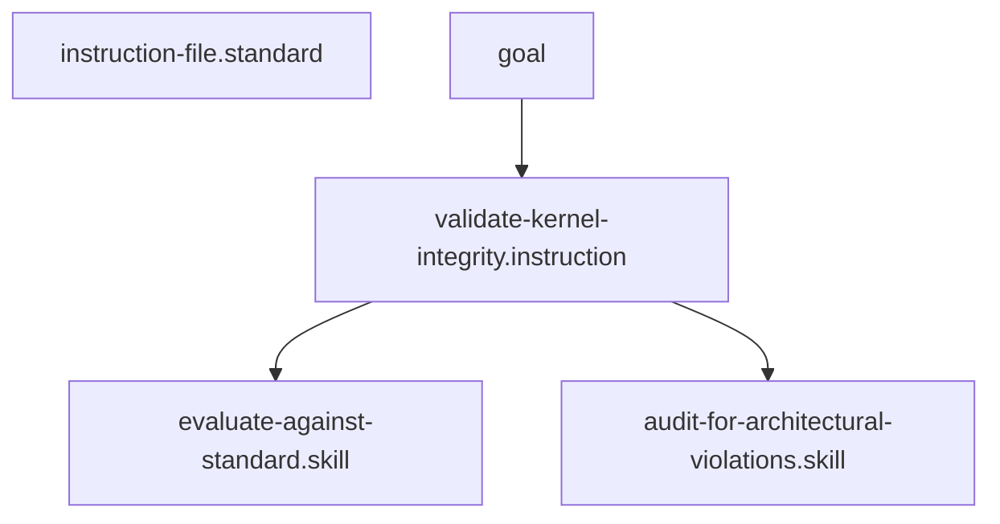

## Context
A supreme maintenance workflow for auditing and remediating the entire repository against all architectural and file-type standards.

# Validate Kernel Integrity

This is the ultimate quality assurance workflow for the AI Kernel.

## Architecture

## Execution Steps

1. **Metadata Audit**: Execute the [Perform Frontmatter Audit](instructions/perform-frontmatter-audit.instruction.md) instruction. Fix any missing or malformed fields immediately.
2. **Graph Validation**: Execute the [Verify Repository Integrity](instructions/verify-repository-integrity.instruction.md) instruction. Resolve any broken IDs or dangling references.
3. **Architectural Sweep**: Run [Audit for Architectural Violations](skills/audit-for-architectural-violations.skill.md) across all core folders. Identify any non-atomic skills or un-orchestrated instructions.
4. **Standards Compliance**: Run `evaluate-against-standard.skill` on a representative sample (or all) files using their specific file-type standards (e.g., `agent-file.standard.md`).
5. **Remediation**: - If critical violations are found, execute the [Refactor to Kernel Standards](instructions/refactor-to-kernel-standards.instruction.md) instruction to modularize or extract content.
6. **[Quality Gate](glossary/quality-gate.glossary.md)**: - Task the **Standards Auditor** to perform a final pass on the entire repository.
    - Zero **U** (Unacceptable) ratings must remain before the audit is marked as successful.
7. **Reporting**: Generate a final summary in the `/context/` folder documenting the audit results and any major refactors performed.

## Postconditions
1. The system state matches the goal defined in the frontmatter.
2. All related Knowledge Graph nodes are updated and linked.
