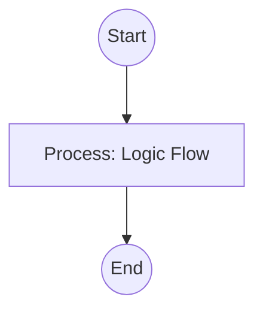

## Context
Orchestrates the indexing and reference discovery skills to ensure knowledge graph integrity and delegation safety.

# Verify Repository Integrity

This instruction ensures the repository's [Knowledge Graph](glossary/knowledge-graph.glossary.md) is unbroken and safe.

## Architecture

## Steps

1. **Index**: Run `collect-repo-ids.skill` to build the master list of valid IDs.
2. **Discovery**: Run `find-frontmatter-refs.skill` to map all dependencies.
3. **Cross-Check**: Verify every reference against the master ID list.
4. **Delegation Audit**: Run `detect-circular-delegation.skill` on the `agents/` directory.
5. **[Quality Gate](glossary/quality-gate.glossary.md)**:
    - If any ID is missing, flag as a critical standard violation.
    - If circular delegations are found, flag as a critical structural failure.
    - Report all broken nodes or loops to the user for remediation.

## Postconditions
1. The system state matches the goal defined in the frontmatter.
2. All related Knowledge Graph nodes are updated and linked.
