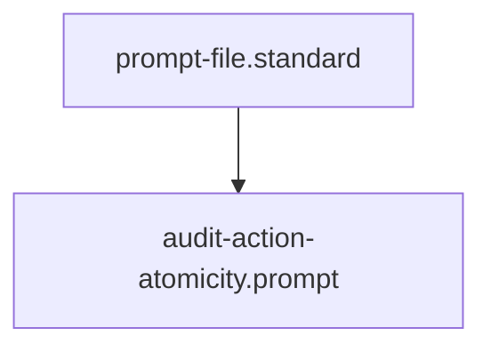

## Context
Automated context for Diamond Posture.

# Audit Action Atomicity

Analyze the target action (Skill or Instruction) for the following "Bloat Triggers":

1. **Multiple Verbs**: Does the summary or title use "and" or multiple action verbs (e.g., "Find and Replace", "Audit and Heal")? If yes, it **Violates Atomicity**.
2. **Tool Drift**: Does the skill use more than one tool (e.g., `grep` and `sed`)? If yes, it **Violates Atomicity**.
3. **Implicit Orchestration**: Is a skill performing a workflow that should be in an **Instruction**? (e.g., a skill that calls multiple other skills).

## Grading
- **Atomic (P)**: One tool, one verb, one clear output.
- **Complex (D)**: Functional but needs splitting.
- **Bloated (U)**: Fatal error; requires immediate refactor.

## Architecture

