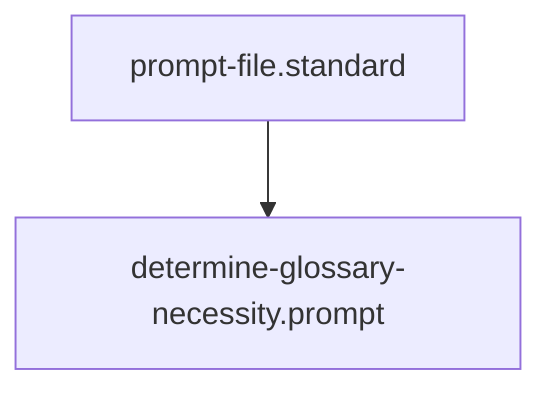

## Context
Automated context for Diamond Posture.

# Determine Glossary Necessity

Apply the following "3-Strike Rule" and "Ambiguity Check" to any concept being used in a standard or instruction:

1. **Cross-Domain Utility**: Is this term used in more than one folder (e.g., `standards/` and `agents/`)? If yes, it **Must** be in the glossary.
2. **Naming Conflict**: Is the term "Generic" but our use is "Specific" (e.g., `Context`)? If yes, it **Must** be in the glossary with a specificity hierarchy.
3. **Complexity**: Does the term require more than one sentence to explain? If yes, it **Must** be in the glossary to prevent "Definition Bloat" in instructions.

## Logic Flow
- **Inline**: If the term is common language and used once.
- **Link**: If the term exists in `glossary/`.
- **Create**: If the term meets the criteria above and is missing from the glossary.

## Architecture

