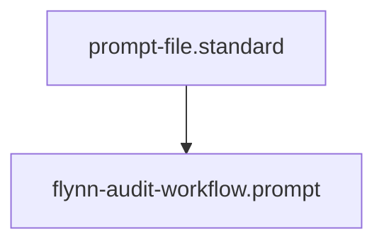

## Context
Automated context for Diamond Posture.

# Flynn's Audit Workflow

This prompt defines the "Chain of Command" for performing a comprehensive AI Kernel audit.

## Execution Pattern

1. **The Discovery & Integrity Pass**: Task the **[Integrity Guardian](../agents/integrity-guardian.agent.md)** and **[Linkage Specialist](../agents/linkage-specialist.agent.md)** to perform a technical sweep.
    - **Integrity**: Verify frontmatter, hierarchy, and delegation loops.
    - **Linkage**: Identify orphaned nodes and missing cross-references.
2. **The Semantic & Compliance Pass**: Task the **[Semantic Auditor](../agents/semantic-auditor.agent.md)** and **[Standards Auditor](../agents/standards-auditor.agent.md)** to evaluate logic.
    - **Semantic**: Flag multi-action skills or un-orchestrated instructions.
    - **Compliance**: Assign PADU ratings and identify enforcement gaps.
3. **The Knowledge Synthesis**: Task the **[Librarian](../agents/librarian.agent.md)** to scan for conceptual overlap.
    - Ensure new additions are linked to the glossary.
    - Deduplicate any inline definitions.
4. **The Evolutionary Loop**: If recurring patterns are identified, task the **[Standards Scout](../agents/standards-scout.agent.md)** to codify them into new atomic standards.

## Architecture

