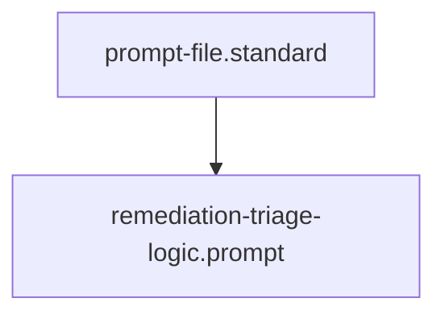

## Context
Automated context for Diamond Posture.

# Remediation Triage Logic

When presented with multiple violations, prioritize them in the following order:

1. **P0: Structural Integrity** (ID Collisions, Naming Violations, File System Errors).
    - *Rationale*: These prevent automated tools from functioning correctly.
2. **P1: Linkage & Reachability** (Orphaned Nodes, Broken Parent Links).
    - *Rationale*: These prevent knowledge discovery and auditing.
3. **P2: Quality Gate Failures** (Missing PADU columns, vague standards).
    - *Rationale*: These allow "Soft" logic to leak into the system.
4. **P3: Documentation Debt** (Missing Context/Architecture sections).
    - *Rationale*: These increase cognitive load but do not break the "Hard" logic of the system.

## Architecture

## Quality Gate
A remediation plan is invalid if it addresses P3 debt while P0 or P1 violations remain unaddressed.
