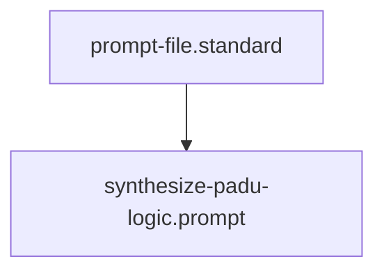

## Context
Automated context for Diamond Posture.

# Synthesize PADU Logic

Use the following heuristic to assign quality ratings to a technical practice:

- **Preferred (P)**:
    - The "Golden Path" for the repository.
    - Deterministic, enforceable, and highly modular.
    - Example: Automated ID uniqueness checking.
- **Acceptable (A)**:
    - Effective but may have manual or subjective components.
    - Useful in specific contexts where automation is difficult.
    - Example: Detailed agent-audited rationales.
- **Discouraged (D)**:
    - Functional but introduces technical debt or complexity.
    - Prone to error or "Soft Governance."
    - Example: Large, instruction-heavy files (use prompts instead).
- **Unacceptable (U)**:
    - Violates a core architectural principle (Atomicity, Orchestration, SSOT).
    - Breaks the Knowledge Graph or creates un-owned content.
    - Example: ID collisions or circular delegations.

## Output Format
Always provide a concise **Rationale** and a specific **Enforcement** method for every rating.

## Architecture

