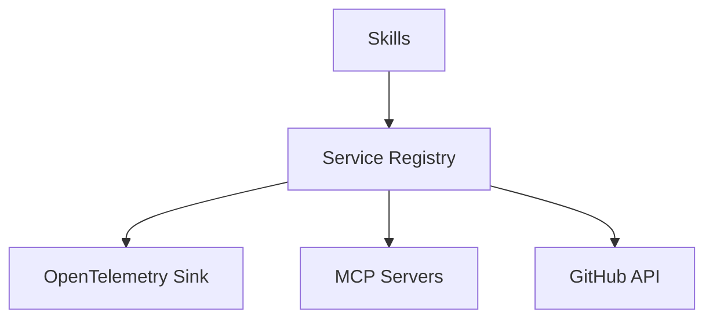

# Service Registry

## Context
The Service Registry is the AI Kernel's "Identity and Access Management" layer. It provides a deterministic mapping between the kernel's internal logic and external "Adjacent Services" (Telemetry sinks, Context providers, Documentation sites).

## Architecture

## Domains
- **`service-map.md`**: The master registry of service endpoints and their roles.
- **`auth-standards.md`**: Guidelines for secure authentication with external services.

## Quality Gate
- **Verification**: Every external service used by a **Driver** must be registered.
- **Enforcement**: Hardcoding endpoints or secrets in skill/driver files is **Unacceptable (U)**.
