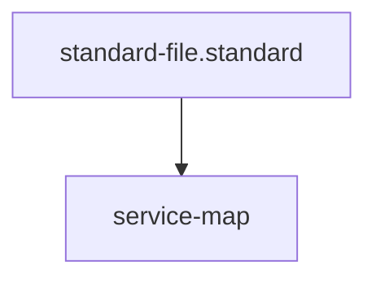

---
id: service-map
title: Global Service Map
type: registry
tags: [registry, networking, services, endpoints, connectivity, definition, config]
summary: The master registry of external services connected to the AI Kernel.
parent_standard: standard-file.standard
glossary_refs: [context.glossary, driver.glossary, standard.glossary]
---# Global Service Map

## Registry

| Service Name | Role | Protocol | Endpoint | Auth Method |
| :--- | :--- | :--- | :--- | :--- |
| **OTel Collector** | Telemetry Sink | OTLP/HTTP | `localhost:4318` | None (Local) |
| **GitHub API** | Context Provider | REST | `api.github.com` | `GITHUB_TOKEN` |
| **Kernel MCP** | Tool Orchestrator | MCP/HTTP | `localhost:8080` | None (Local) |

## Configuration Matrix

### Telemetry (OTel)
- **Primary Endpoint**: `OTEL_EXPORTER_OTLP_ENDPOINT`
- **Enforcement**: Mandatory for all `master_healer` traces.

### Context (MCP)
- **Primary Server**: `KERNEL_MCP_URL`
- **Capabilities**: `git-fetch`, `jira-sync`, `slack-notify`.

## Quality Gate
- **Verification**: Run `python3 drivers/kernel/connectivity_auditor.py` to verify registered endpoints.
- **Enforcement**: Any unregistered service found in a driver is a **Standard Violation (A)**.

## Architecture

