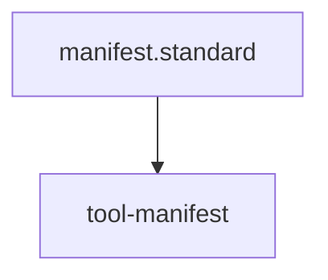

# Kernel Tool Manifest

## Exported Tools

| Tool Name | Internal Skill | Description | Primary Input |
| :--- | :--- | :--- | :--- |
| **global_heal** | `global-healing-wave.skill` | Triggers a repository-wide restoration wave. | None |
| **impact_audit** | `trace-impact-chain.skill` | Traces the blast radius of a target ID. | `target_id` |
| **compliance_audit** | `audit-for-architectural-violations.skill` | Performs a full structural compliance health check. | None |
| **content_audit** | `audit-content-quality.skill` | Sweeps for placeholder debt and knowledge density. | None |

## Capability Matrix

### Structural Integrity
- **Verification**: `global_heal` ensures 100% diagram and frontmatter compliance.
- **Enforcement**: `compliance_audit` flags any architectural drift.

### Semantic Awareness
- **Verification**: `impact_audit` prevents breaking changes in core nodes.
- **Enforcement**: `content_audit` ensures high-density documentation.

## Quality Gate
- **Verification**: Every exported tool must be backed by a verified **Diamond Driver**.
- **Enforcement**: Changes to the Manifest must be audited via the `trace-impact-chain.skill`.

## Architecture

