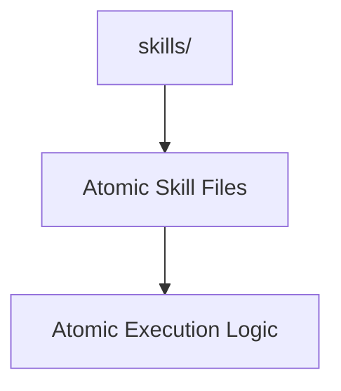

# Skills Manifest

## Context
This folder contains the atomic, tool-based capabilities of the AI Kernel.

## Architecture

## File Registry

| ID | Type | Summary |
|---|---|---|
| `audit-repository-connectivity.skill` | Skill | Verifies Knowledge Graph reachability. |
| `check-id-uniqueness.skill` | Skill | Ensures all IDs are unique and deterministic. |
| `doc-audit.skill` | Skill | Audits files for structural headers. |
| `tel-audit.skill` | Skill | Audits code for telemetry compliance. |
| `triage-architectural-violations.skill` | Skill | Ranks debt by P0-P3 priority. |
| `identify-out-of-scope-content.skill` | Skill | Detects semantic bleeding and conflation. || `find-similar-terms.skill` | Skill | Detects semantic collisions in the glossary. |
| `extract-prompt.skill` | Skill | Extracts modular AI logic into prompts. |
| `evaluate-against-standard.skill` | Skill | Audits content against PADU tables. |

## Quality Gate
- **Verification**: Every skill must include a **Verification Protocol**.
- **Enforcement**: This manifest must be in 1:1 sync with the filesystem.
