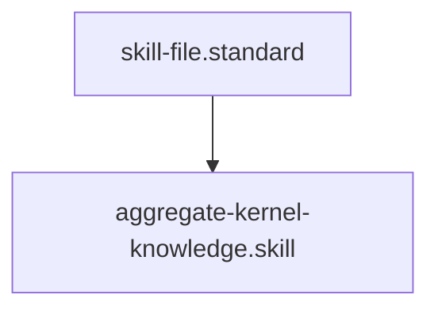

# Kernel Knowledge Aggregator

## Context
Agents often waste tokens searching for existing standards or skills. This skill provides a "Global Index" of the AI Kernel, allowing agents to instantly identify relevant nodes without recursive directory scanning.

## Architecture

## Execution Steps
1. **Engine Invocation**: Run `repo_aggregator.py`.
2. **Parsing**: Load the JSON output into the current session context.
3. **Lookup**: Search for the target ID or keyword in the aggregated `nodes` list.

## Verification Protocol
1. Run `python3 drivers/kernel/repo_aggregator.py`.
2. Verify that `master_healer.driver` and `aggregate-kernel-knowledge.skill` are both present in the output.

## Quality Gate
- **Verification**: Output must be valid JSON.
- **Enforcement**: Mandatory for all "Planning" and "Audit" workflows to ensure token efficiency.
