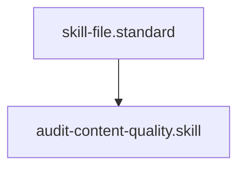

# Content Excellence Auditor

## Context
High-integrity governance requires high-quality documentation. Structural compliance is useless if the content is shallow or filled with placeholders. This skill ensures that every node in the AI Kernel provides meaningful, high-density knowledge.

## Architecture

## Execution Steps
1. **Engine Invocation**: Run `content_auditor.py`.
2. **Review**: Inspect the `violations` list for files with "Placeholder Debt" or "Low Density."
3. **Healing**: Prioritize healing the "Thinnest" files first to ensure the Knowledge Graph has substance.

## Verification Protocol
1. Insert "TODO: fix this" into a standard.
2. Run `python3 drivers/kernel/content_auditor.py`.
3. Verify the file is flagged for placeholder debt.

## Quality Gate
- **Verification**: Output must be a valid JSON content audit.
- **Enforcement**: Files with `TODO` or `FIXME` are **Unacceptable (U)** and must be resolved before any version promotion.
