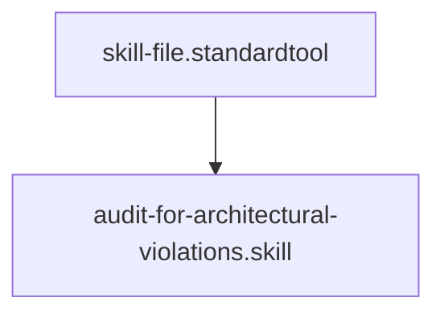

## Context
Analyzes kernel files for violations of core architectural principles, including atomicity, orchestration, and hidden tool dependencies.

# Audit for Architectural Violations

This skill performs a "maximalist" check for architectural integrity.

## Architecture

## Execution Steps

1. **Check for [Atomicity](glossary/atomicity.glossary.md)**:
    - (For Skills) Verify the file uses exactly one tool.
    - **Hidden Tool Detection**: Scan the body for undeclared CLI utilities (e.g., `sed`, `awk`, `jq`, `curl`, `python`). Cross-check with the `tool` field.
2. **Check for [Orchestration](glossary/orchestration.glossary.md)**:
    - (For Instructions) Ensure tool actions (like `mkdir`, `grep`, `rm`) are NOT performed directly. Instructions must coordinate skills.
3. **Check for Inline Definitions**: (Global) Ensure technical concepts link to the glossary rather than being defined locally.
4. **Report**: provide a detailed list of violations.

## Verification Protocol
1. Perform a manual dry-run of the execution steps.
2. Verify that the output matches the expected result defined in the Quality Gate.

## Quality Gate

The output of this skill is governed by the **[Skill File Standard](../standards/skill-file.standard.md)**.
- **Verification**: Ensure every violation reported contains a clear [Rationale](../glossary/padu-scale.glossary.md) and a link to the violated standard.
- **Enforcement**: If a file fails the [Orchestration](../glossary/orchestration.glossary.md) check, it must be marked as **Unacceptable (U)** and remediated before the next commit.

