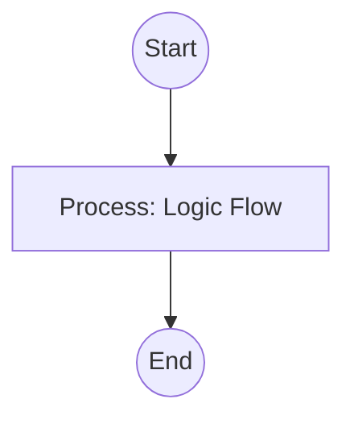

## Context
Verifies that every file contains the mandatory YAML frontmatter fields required by its type.

# Audit Frontmatter Completeness

This skill ensures that every node in the Knowledge Graph is fully indexed and correctly placed in the standard hierarchy.

## Architecture

## Execution Steps

1. **Detect Type**: Read the `type:` field in the frontmatter.
2. **Verify Mandatory Fields**:
    - **Global**: `id`, `title`, `type`, `version`, `created`, `updated`, `summary`.
    - **Standard**: `scope`, `glossary_refs`, `parent_standard` (mandatory for all except `kernel.standard`).
    - **Skill**: `tool`, `inputs`, `outputs`.
    - **Instruction**: `goal`, `skills`.
    - **Agent**: `role`, `authority`, `delegates`.
3. **Report**: provide a list of missing or malformed fields.

## Verification Protocol
1. Perform a manual dry-run of the execution steps.
2. Verify that the output matches the expected result defined in the Quality Gate.

## Quality Gate

Metadata integrity is governed by the **[Standard File Standard](../standards/standard-file.standard.md)**.
- **Verification**: The audit must check for both the presence and the non-emptiness of required fields.
- **Enforcement**: Files with missing mandatory fields are **Unacceptable (U)** and will break repository indexing until fixed.
