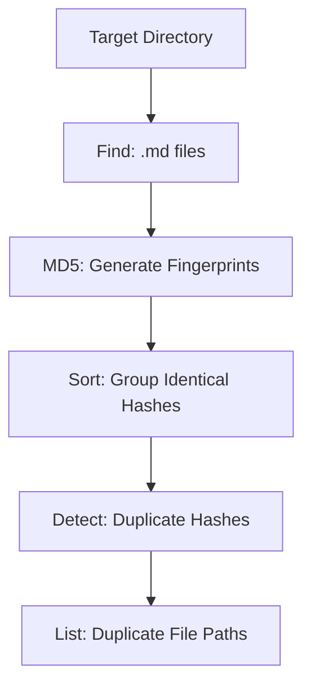

# Redundant Content Auditor

## Context
Redundancy is the enemy of SSOT (Single Source of Truth). This skill identifies files that have different names but identical content, allowing for surgical deduplication.

## Architecture

## Execution Steps
1. Specify the directory to audit.
2. Execute the hash-and-compare pipe.
3. Review the duplicate list and perform atomic deletion or linking.

## Verification Protocol
1. Create a copy of an existing file: `cp target.md target_copy.md`.
2. Run the skill on the directory.
3. Verify that `target_copy.md` is listed as a duplicate.

## Quality Gate
- **Verification**: Only byte-identical files are flagged.
- **Enforcement**: Zero byte-identical duplicates permitted in the logic domains.
