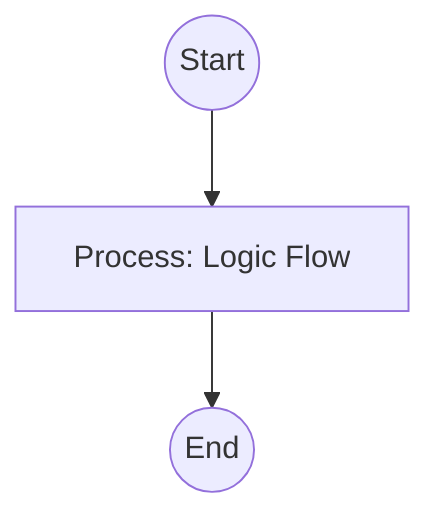

## Context
Identifies inline definitions that should be replaced with links to the glossary.

# Audit Redundant Content

This skill helps maintain the "Single Source of Truth" principle by finding where concepts are being defined manually instead of referenced.

## Architecture

## Execution Steps

1. **Load All Glossary IDs**: Get a list of all IDs from `glossary/`.
2. **Scan Path**: For each ID, search the target `path` for occurrences of the term or its aliases.
3. **Identify Definitions**: Use heuristics (e.g., proximity to "is a", "defined as") to distinguish between a reference and a definition.
4. **Propose Refactor**: Suggest replacing the inline definition with a link to the glossary entry.

## Verification Protocol
1. Perform a manual dry-run of the execution steps.
2. Verify that the output matches the expected result defined in the Quality Gate.

## Quality Gate

Repository integrity is governed by the **[Glossary Entry Standard](../standards/glossary-entry.standard.md)**.
- **Verification**: Ensure that every proposed refactor includes the correct `file:///` link to the glossary.
- **Enforcement**: Redundant definitions found in core folders (`agents/`, `standards/`) are **Unacceptable (U)** and must be merged immediately.
