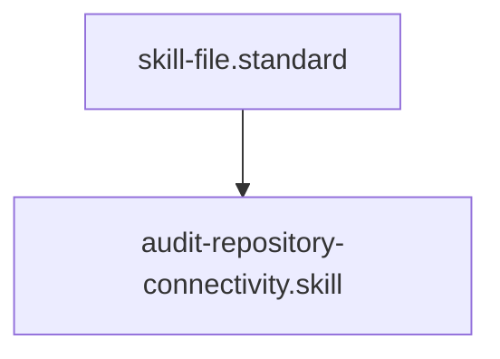

# Connectivity Auditor

## Context
A disconnected node is "Dark Knowledge." This skill uses graph-traversal logic to ensure every node in the AI Kernel is reachable from the root standards.

## Architecture

## Execution Steps
1. **Target Identification**: Specify the repository root.
2. **Engine Invocation**: Run `connectivity_auditor.py`.
3. **Healing**: Link any identified orphans to their appropriate parent standard or manifest.

## Verification Protocol
1. Create a "Floating Node" with no `parent_standard` and no references in other files.
2. Run `python3 engines/connectivity_auditor.py .`.
3. Verify that the floating node's ID appears in the `orphans` list.

## Quality Gate
- **Verification**: Zero orphans allowed (excluding `kernel.standard`).
- **Enforcement**: Any unreachable node is **Unacceptable (U)**.
