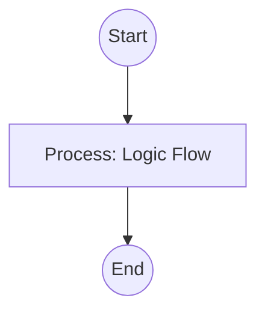

## Context
Analyzes the Knowledge Graph for orphaned nodes, missing frontmatter references, and linkage gaps.

# Audit Repository Connectivity

This skill ensures that the Knowledge Graph is a dense, traversable network rather than a collection of isolated files.

## Architecture

## Execution Steps

1. **Map All Nodes**: Run `collect-repo-ids.skill` to get the master list.
2. **Map All References**: Run `find-frontmatter-refs.skill` to see all current connections.
3. **Identify Orphans**:
    - For every ID in the master list, check if it appears in any other file's `glossary_refs`, `standards`, or body.
    - Flag nodes with zero incoming references as **Orphaned**.
4. **Identify Context Gaps**:
    - Scan the body of files for terms that exist in the glossary but are missing from the `glossary_refs` frontmatter.
    - Ensure every skill links to its `parent_standard` and relevant `standards`.
5. **Report**: provide a detailed "Linkage Health" report.

## Verification Protocol
1. Perform a manual dry-run of the execution steps.
2. Verify that the output matches the expected result defined in the Quality Gate.

## Quality Gate

Graph density is governed by the **[Kernel Standard](../standards/kernel.standard.md)**.
- **Verification**: Every new file must have at least one incoming reference from a parent standard, a manifest, or a related glossary entry.
- **Enforcement**: Orphaned nodes are marked as **Discouraged (D)** and should be linked or deprecated.
