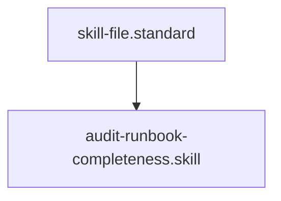

[Home](/) > [Docs](/docs/readme.md) > [Governance](/docs/governance/readme.md) > [Protocol](readme.md) > Runbook Completeness

## 1. Objective
Ensure every system component is documented for recovery and triage to minimize Downtime (MTTR).

## 2. Requirement Mapping
- **Action:** Verify the [Universal System Runbook](/docs/operational/runbook/universal-runbook.md) exists and links to all system-wide dashboards.
- **Action:** Verify every critical span has a corresponding **Span Runbook** ([doc-ops-span-runbook](/docs/developer/pattern/doc-ops-span-runbook.md)).
- **Action:** Verify every Span Runbook links to at least one **Restoration Step** ([doc-ops-restoration-step](/docs/developer/pattern/doc-ops-restoration-step.md)).
- **Verify:** Runbooks and steps follow the standardized patterns and breadcrumbs.

## 3. Verification
- **Action:** Attempt to execute the triage matrix in the runbook against simulated or real telemetry.
- **Verify:** The "Global Escalation" contact is accurate and reachable.

## Architecture

