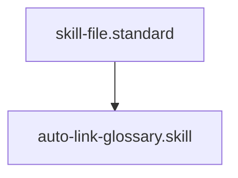

# Auto-Link Glossary

## Context
Manual linkage is the primary source of "Reachability Debt." This skill automates the connection between documentation bodies and their semantic definitions, ensuring the Knowledge Graph is always perfectly linked.

## Architecture

## Execution Steps
1. **Target Identification**: Specify the new or modified file.
2. **Engine Invocation**: Run `auto_linker.py`.
3. **Verification**: Confirm that the `glossary_refs` field has been updated in the frontmatter.

## Verification Protocol
1. Create a file containing the word "Determinism" with an empty `glossary_refs: []`.
2. Run `python3 engines/auto_linker.py test.md`.
3. Verify that `glossary_refs` now contains `determinism.glossary`.

## Quality Gate
- **Verification**: Linked references must exist in the `glossary/` directory.
- **Enforcement**: Mandatory step for all new documentation nodes to ensure 100% reachability.
