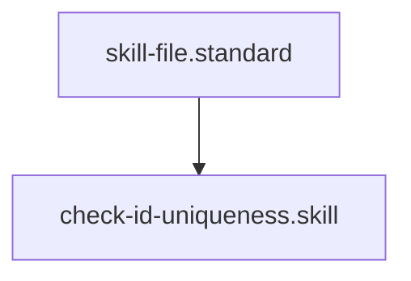

# ID Uniqueness Auditor

## Context
Global uniqueness is the primary constraint for the AI Kernel Knowledge Graph. This skill identifies ID collisions across all domains to prevent cross-linking errors and semantic confusion.

## Architecture

## Execution Steps
1. **Target Identification**: Specify the repository root or a sub-folder.
2. **Engine Invocation**: Run `id_auditor.py`.
3. **Surgical Triage**: Address any collisions identified in the JSON output.

## Verification Protocol
1. Create two files with the same `id: duplicate.test`.
2. Run `python3 scratch/id_auditor.py .`.
3. Verify that `duplicate.test` appears in the JSON output with both file paths.

## Quality Gate
- **Verification**: Output must be an empty JSON object `{}` in a healthy repo.
- **Enforcement**: Zero collisions are permitted in the stable branch.
