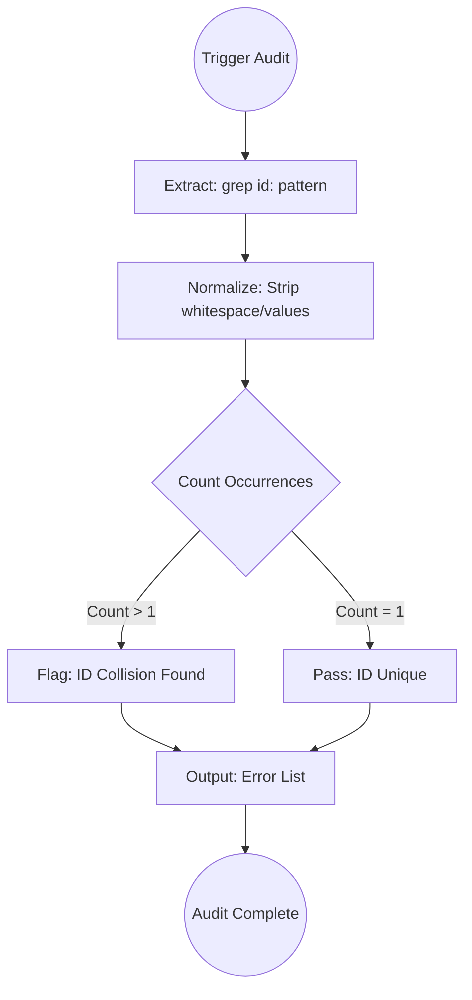

# Check ID Uniqueness

## Context
In a decentralized Knowledge Graph, ID collisions are a fatal error. If two files share an ID, cross-references become ambiguous and the graph's integrity is compromised. This skill serves as the **Global Safety Gate**, ensuring that every identifier in the repository is a unique, deterministic pointer.

## Architecture

## Execution Steps

1. **Extract IDs**: Run `grep -r "id:" .` across the repository.
2. **Normalize**: Strip whitespace and extract the ID values.
3. **Count Occurrences**: Identify any ID that appears more than once.
4. **Report Collisions**:
    - List the duplicated ID.
    - provide the absolute paths of all files claiming that ID.

## Verification Protocol
1. Perform a manual dry-run of the execution steps.
2. Verify that the output matches the expected result defined in the Quality Gate.

## Quality Gate

ID integrity is governed by the **[Kernel Standard](../standards/kernel.standard.md)**.
- **Verification**: The check must be case-sensitive and scan all file types except `README.md`.
- **Enforcement**: Any ID collision is an **Unacceptable (U)** violation. The repository is considered "Broken" until the collision is resolved via renaming.
