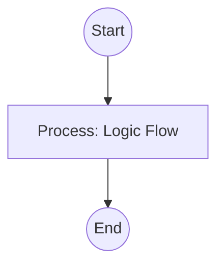

## Context
Extracts all unique 'id' fields from the repository's YAML frontmatter.

# Collect Repository IDs

Atomic skill for indexing the repository.

## Architecture

## Execution Steps

1. **Grep**: Search for `id:` at the start of frontmatter blocks.
2. **Normalize**: Strip whitespace and prefixes.
3. **Report**: provide the master list of discovered IDs.

## Verification Protocol
1. Perform a manual dry-run of the execution steps.
2. Verify that the output matches the expected result defined in the Quality Gate.
