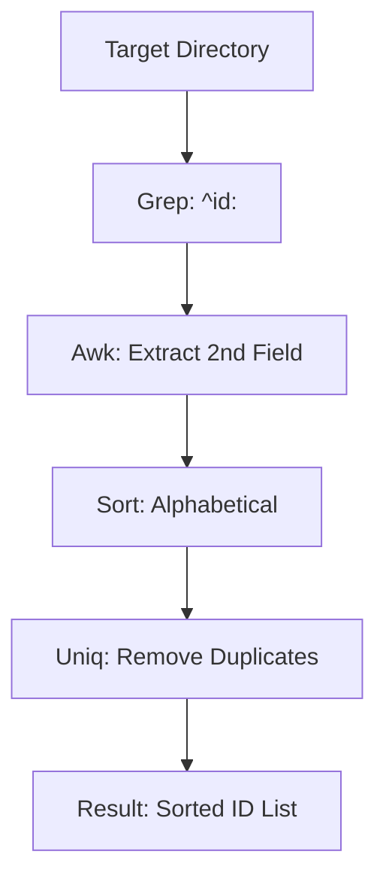

# Collect Repository IDs

## Context
To perform graph-wide operations (like checking for orphans or broken links), we first need a clean list of all available IDs. This bash pipe provides that list in milliseconds.

## Architecture

## Execution Steps
1. Specify the repository root.
2. Execute the bash pipe.
3. Use the list as the "Source of Truth" for graph traversal.

## Verification Protocol
1. Count the number of `.md` files in `glossary/`.
2. Run the skill on `glossary/`.
3. Verify the ID count matches the file count (assuming 1 ID per file).

## Quality Gate
- **Verification**: Output must be a clean, newline-separated list of IDs.
- **Enforcement**: Mandatory step before running any graph-wide connectivity audit.
