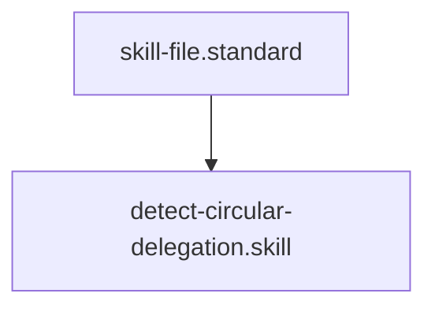

# Agent Cycle Detector

## Context
Multi-agent orchestration is vulnerable to infinite loops if delegation is not a Directed Acyclic Graph (DAG). This skill uses graph-traversal logic to ensure that "Agentic Loops" are identified and broken.

## Architecture

## Execution Steps
1. **Engine Invocation**: Run `cycle_detector.py` against the `agents/` directory.
2. **Analysis**: Inspect the `cycles` list in the JSON output.
3. **Healing**: Break any identified loops by refining the `delegates: []` metadata.

## Verification Protocol
1. Create `agentA` delegating to `agentB`.
2. Create `agentB` delegating back to `agentA`.
3. Run `python3 drivers/kernel/cycle_detector.py`.
4. Verify that the cycle `[agentA, agentB, agentA]` is reported.

## Quality Gate
- **Verification**: Output must be `{"cycles": []}` in a healthy kernel.
- **Enforcement**: Any circular delegation is a **Critical Failure (U)** and must be resolved before deployment.
