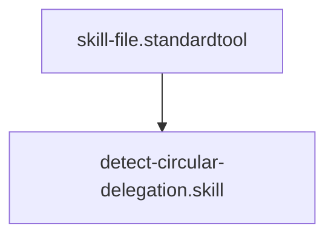

## Context
Analyzes the agent delegation graph to identify infinite logic loops.

# Detect Circular Delegation

This skill ensures that the agent peer network remains a Directed Acyclic Graph (DAG).

## Architecture

## Execution Steps

1. **Collect Agents**: Scan the `agents/` directory for all `id` and `delegates` frontmatter fields.
2. **Build Graph**: Create a map where each agent ID points to its list of delegates.
3. **Traverse**: Perform a Depth-First Search (DFS) or use a cycle detection algorithm to find loops.
4. **Report**:
    - List every agent involved in a cycle.
    - provide the exact path of the loop (e.g., `flynn -> standards-auditor -> flynn`).

## Verification Protocol
1. Perform a manual dry-run of the execution steps.
2. Verify that the output matches the expected result defined in the Quality Gate.

## Quality Gate

The integrity of the agent network is governed by the **[Agent File Standard](../standards/agent-file.standard.md)**.
- **Verification**: Any cycle detected must be presented as a clear path of delegation IDs.
- **Enforcement**: If cycles are found, the delegation model is marked as **Unacceptable (U)** and must be broken before any further [Delegation](../glossary/delegation.glossary.md) actions are performed.
