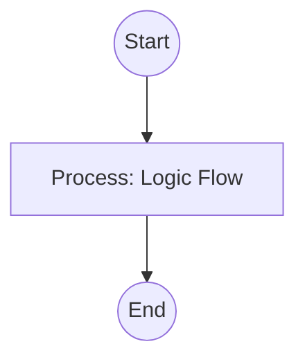

## Context
Upgraded structural auditor that enforces the Tiered Documentation Model (Local vs. Architecture vs. Persona).

# Audit Technical Documentation

This skill enforces the "Layered Knowledge" requirement of the AI Kernel.

## Architecture

## Execution Steps

1. **Identify Tier**:
    - If file is in `docs/architecture/` -> Apply `doc-architecture.standard`.
    - If file is a `README.md` in a code folder -> Apply `doc-local.standard`.
    - If file is tagged `developer` -> Apply `doc-developer.standard`.
    - If file is tagged `external` -> Apply `doc-external.standard`.
2. **Layer-Specific Checks**:
    - **Architecture**: Verify presence of Mermaid maps and links to `README.md` files. Flag deep implementation details as **Unacceptable (U)**.
    - **Local**: Verify "Technical Detail" sections. Flag global system context as **Unacceptable (U)**.
    - **Persona**: Check tags. Ensure "Maintainer" docs have **Restoration** links.
3. **SSOT Check**: Invoke `audit-redundant-content.skill` to ensure no "Rehashing" of glossary terms is occurring.
4. **Report**: provide a tier-aware compliance report.

## Verification Protocol
1. Perform a manual dry-run of the execution steps.
2. Verify that the output matches the expected result defined in the Quality Gate.

## Quality Gate

Documentation quality is governed by the **[Kernel Standard](../standards/kernel.standard.md)**.
- **Verification**: The audit must identify the specific "Tier Violation" (e.g., "Architecture doc is too detailed").
- **Enforcement**: Tier violations are **Unacceptable (U)** and will block the **Self-Healing Loop**.
