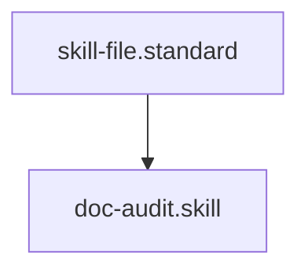

# Document Auditor

## Context
Structural integrity is the foundation of the AI Kernel's machine-readability. This skill replaces manual "reading" with deterministic regex-based parsing to ensure every node possesses its mandatory headers (Context, Architecture, Quality Gate).

## Architecture

## Execution Steps
1. **Target Identification**: Specify the folder to be audited.
2. **Engine Invocation**: Run the `doc_auditor.py` script against the target.
3. **Synthesis**: Process the JSON output to identify high-priority debt.

## Verification Protocol
1. Create a "Bad File" missing a `## Context` header.
2. Run `python3 drivers/doc_auditor.py .`
3. Verify that the "Bad File" is correctly flagged in the JSON output.

## Quality Gate
- **Verification**: Output must be a valid JSON object.
- **Enforcement**: 100% accuracy in detecting missing mandatory headers.
