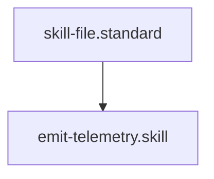

---
id: emit-telemetry.skill
title: Telemetry Audit Emitter
type: skill
tags: [telemetry, observability, otel, audit, tool, action, execution]
interface:
  input: { name: "span.name", attributes: { key: "value" } }
  output: { status: "success", code: 200 }
implementation:
  engine: "python3 drivers/telemetry/otel_emit.py"
  command: "python3 drivers/telemetry/otel_emit.py '{{name}}' '{{attributes}}'"
summary: Emits structured audit spans to an OpenTelemetry collector for centralized observability.
parent_standard: skill-file.standard
glossary_refs: [context.glossary]
---# Telemetry Audit Emitter

## Context
Standardizes the process of reporting "Governance Events" to external observability platforms. Every major healing wave or architectural change should emit a trace to ensure full accountability.

## Execution Steps
1. **Engine Invocation**: Run `otel_emit.py`.
2. **Verification**: If in `debug_mode`, verify the trace is logged locally in `context/telemetry.log`.

## Quality Gate
- **Verification**: Spans must include the `service.name` attribute set to `ai-kernel`.
- **Enforcement**: Any critical healing failure MUST emit a span with `error: true`.

## Architecture

## Verification Protocol
1. Run `python3 drivers/telemetry/otel_emit.py 'test-span' '{}'`.
2. Verify output status is `success` or `debug_mode`.
