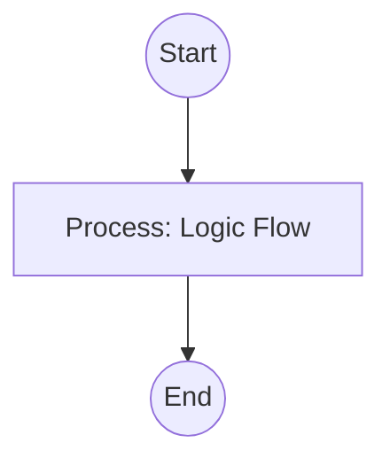

## Context
Evaluates a target file or practice against a specific PADU table.

# Evaluate Against Standard

This is the primary quality enforcement skill of the AI Kernel.

## Architecture

## Execution Steps

1. **Load Standard**: Read the PADU table and Enforcement section from the `standard_id` file (`*.standard.md`).
2. **Scan Target**: Analyze the `target` file for adherence. Use the **[Kernel Standard](../standards/kernel.standard.md)** to determine the correct selector for the target type.
3. **Assign Ratings**: For each practice, assign a P, A, D, or U rating based on the standard's Rationale.
4. **Identify Gaps**: If a practice lacks automated enforcement but is violated, flag it in the report.
5. **Report**: provide the final PADU assessment and remediation steps.

## Verification Protocol
1. Perform a manual dry-run of the execution steps.
2. Verify that the output matches the expected result defined in the Quality Gate.

## Quality Gate

Standardized evaluation is governed by the **[Standard File Standard](../standards/standard-file.standard.md)**.
- **Verification**: The evaluation must provide a specific rationale for every rating that deviates from **Preferred (P)**.
- **Enforcement**: If a target receives an **Unacceptable (U)** rating, the Auditor must block the workflow until remediation is complete.
