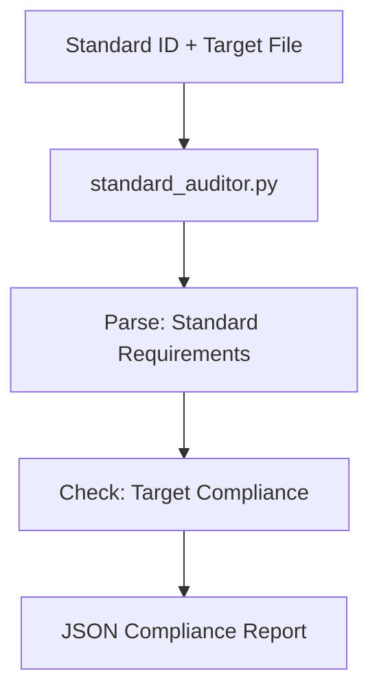

---
id: evaluate-against-standard.skill
title: Standard Compliance Auditor
type: skill
parent_standard: skill-file.standard
tags: [quality, audit, compliance, governance, tool, action, execution]
interface:
  input: { standard_id: "standard_id", target_path: "path/to/file" }
  output: { score: "percentage", details: { "requirement": "PASS/FAIL" } }
implementation:
  engine: "python3 drivers/kernel/standard_auditor.py"
  command: "python3 drivers/kernel/standard_auditor.py {{standard_id}} {{target_path}}"
summary: Deterministically evaluates a file against the requirements of a specific standard.
interface:n  input: { query: "string" }n  output: { results: [] }nimplementation:n  engine: "bash"n  command: "grep {{query}} ."---

# Standard Compliance Auditor

## Context
Fuzzy evaluation leads to quality drift. This skill uses the `standard_auditor.py` engine to objectively verify that a file meets the machine-readable requirements of its governing standard.

## Architecture

## Execution Steps
1. **Define Target**: Identify the file to be audited and its governing standard.
2. **Engine Invocation**: Run `standard_auditor.py`.
3. **Healing**: Address any `FAIL` items identified in the report.

## Verification Protocol
1. Create a "Test Standard" with `requirements: [test_req]`.
2. Create a "Test File" missing the string `test_req`.
3. Run `python3 drivers/kernel/standard_auditor.py test.standard test.file`.
4. Verify the output shows `score: 0.0%` and `test_req: FAIL`.

## Quality Gate
- **Verification**: Output must be a deterministic JSON report.
- **Enforcement**: Mandatory for all "Definition of Done" (DoD) checks.
