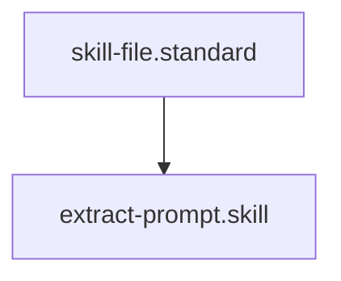

## Context
Identifies instruction-heavy sections in agents or instructions and moves them to the `prompts/` directory.

# Extract Prompt

This skill implements the "Modular Instruction" principle. It decouples the *What to do* (Prompt) from the *Who does it* (Agent) or *How to coordinate it* (Instruction).

## Architecture

## Execution Steps

1. **Identify**: Locate a section (e.g., `## Interaction Pattern`) that contains complex, multi-paragraph AI instructions.
2. **Draft Prompt**:
    - Create a new file in `prompts/` using the `[source-file]-[section-name].md` pattern.
    - Copy the instruction content into the body.
    - Define variables (e.g., `{{input}}`, `{{context}}`) if the logic is reusable.
3. **Refactor Source**:
    - Add the new prompt ID to the `prompts: []` field in the source file's frontmatter.
    - Replace the original section content with a markdown link to the new prompt file.
4. **Verification**: Invoke the **Semantic Auditor** to ensure the extraction didn't lose functional context.

## Verification Protocol
1. Perform a manual dry-run of the execution steps.
2. Verify that the output matches the expected result defined in the Quality Gate.

## Quality Gate

Instruction modularity is governed by the **[Prompt File Standard](../standards/prompt-file.standard.md)**.
- **Verification**: The extracted prompt must be standalone; it should not refer to "This file" or "This agent" implicitly.
- **Enforcement**: Large, inline instruction blocks (300+ words) in non-prompt files are **Discouraged (D)**.
