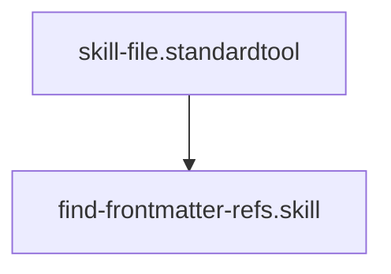

## Context
Scans the repository for fields that reference other IDs (e.g., glossary_refs, standards).

# Find Frontmatter References

Atomic skill for identifying dependencies.

## Architecture

## Execution Steps

1. **Grep**: Search for `glossary_refs`, `standards`, `delegates`, and `context` fields.
2. **Parse**: Extract the list of IDs from these fields.
3. **Report**: provide a map of which files depend on which IDs.

## Verification Protocol
1. Perform a manual dry-run of the execution steps.
2. Verify that the output matches the expected result defined in the Quality Gate.
