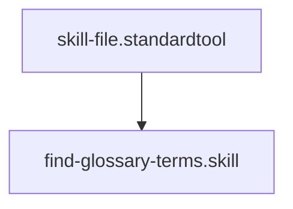

## Context
Searches the glossary for terms or aliases matching a query.

# Find Glossary Terms

This skill uses `grep` to quickly find if a concept is already defined in the glossary, preventing duplication.

## Architecture

## Execution Steps

1. **Search Aliases**: Run `grep -ri` on the `glossary/` folder looking for the query in the `aliases` frontmatter field.
2. **Search Titles**: Search for the query in the `title` frontmatter field.
3. **Filter Results**: Return the unique list of matching files.
4. **Link Suggestion**: If a match is found, provide the link format `[Title](file:///path/to/file)`.

## Verification Protocol
1. Perform a manual dry-run of the execution steps.
2. Verify that the output matches the expected result defined in the Quality Gate.
