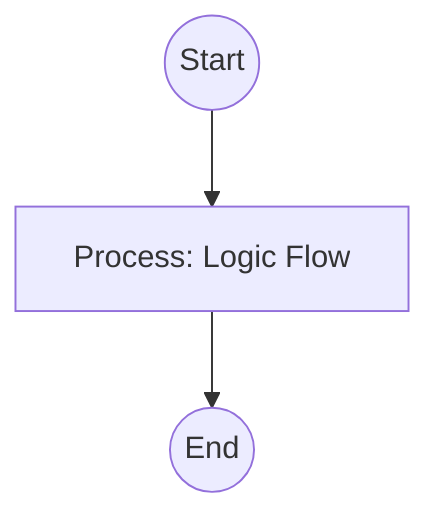

## Context
Searches the glossary for naming collisions, conceptual overlaps, and specificity violations.

# Find Similar Terms

This skill identifies potential naming collisions and conceptual overlaps, ensuring that specific concepts don't pollute general ones.

## Architecture

## Execution Steps

1. **Alias Collision Check**: Compare every `alias` of the target `term` against the master ID list of the repository.
2. **Lexical Search**: Grep the glossary for partial matches. If a match is found, check if one is a sub-string of the other (e.g., `test` vs `unit-test`).
3. **Specificity Audit**:
    - If the `term` is used in a specific context but uses a Level 1 (Root) name, flag it for renaming.
    - Check if a domain prefix exists in the filename that matches the `tags` or `scope` in frontmatter.
4. **Semantic Check**: (LLM-assisted) Compare summaries to detect if the same concept is described under different names (Fragmentation).
5. **Report**: provide a list of candidates for **Namespace Qualification** or **Disambiguation**.

## Verification Protocol
1. Perform a manual dry-run of the execution steps.
2. Verify that the output matches the expected result defined in the Quality Gate.

## Quality Gate

Conceptual clarity is governed by the **[Naming Standard](../standards/naming.standard.md)** and the **[Glossary Entry Standard](../standards/glossary-entry.standard.md)**.
- **Verification**: Ensure that the report explicitly identifies the "Level" (Root/Domain/Implementation) of any colliding terms.
- **Enforcement**: Any Alias-to-ID collision is an **Unacceptable (U)** violation and must be resolved before the term is finalized.

---
**Be Wary Of**: "The broader the concept, the shorter the name." If you are writing a skill for a specific tool, the tool name must be in the filename.
