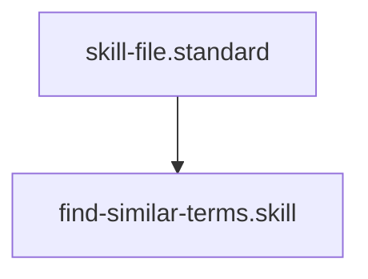

# Glossary Similarity Auditor

## Context
Semantic ambiguity is a form of architectural debt. If two terms describe the same concept (e.g., "Skill" vs. "Function"), they should be consolidated. This skill uses word-overlap analysis to identify potential collisions.

## Architecture

## Execution Steps
1. **Engine Invocation**: Run `similarity_auditor.py`.
2. **Analysis**: Review the JSON list for any similarity scores above 0.5.
3. **Consolidation**: Use the `resolve-naming-ambiguity.instruction` to merge overlapping terms.

## Verification Protocol
1. Create two glossary entries with identical summaries.
2. Run `python3 drivers/similarity_auditor.py`.
3. Verify that the two terms are flagged with a similarity score of `1.00`.

## Quality Gate
- **Verification**: Output must be a valid JSON collision report.
- **Enforcement**: Mandatory step during "Naming and Purity" audits.
