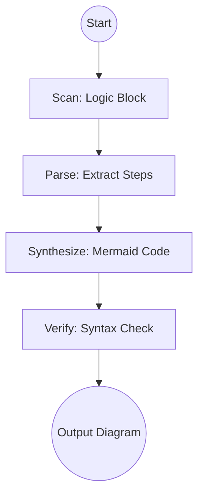

# Generate Mermaid Diagram

## Context
Analyzes the execution logic of a file and synthesizes a Mermaid flowchart representation.

## Architecture

## Execution Steps

1. **Scan**: Identify the primary logic block (e.g., `## Execution Steps` or `## Interaction Pattern`).
2. **Parse**: Extract the sequential or conditional steps.
3. **Synthesize**: Generate a Mermaid `graph TD` or `sequenceDiagram` block.
    - Use clear labels for nodes.
    - Link nodes according to the execution order.
    - Include a "Start" and "End/Quality Gate" node.
4. **Verification**: Invoke the **Semantic Auditor** to ensure the diagram accurately reflects the text.

## Verification Protocol
1. Perform a manual dry-run of the execution steps.
2. Verify that the output matches the expected result defined in the Quality Gate.

## Quality Gate

Visual integrity is governed by our documentation standards.
- **Verification**: The Mermaid code must be syntactically valid and renderable.
- **Enforcement**: Diagrams that contradict the textual steps are **Unacceptable (U)** and must be refactored.
