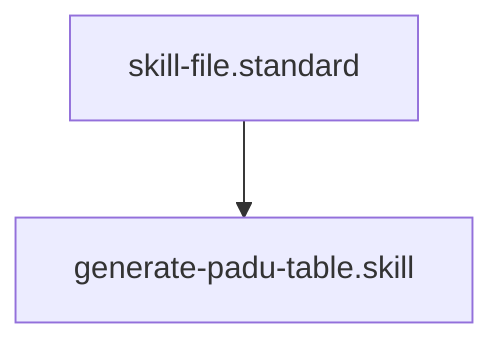

## Context
Synthesizes patterns into a formal, atomic PADU table.

# Generate PADU Table

This skill converts pattern data into the kernel's formal quality format.

## Architecture

## Execution Steps

1. **Synthesize**: Combine industry best practices with codebase realities.
2. **Rank**: Use the **[Synthesize PADU Logic](../prompts/synthesize-padu-logic.prompt.md)** prompt to assign P, A, D, or U ratings.
3. **Draft**: Create the markdown table. **Every practice must fit in a single row.**
4. **Rationalize**: provide a clear reason for the rating and an **Enforcement** method.

## Verification Protocol
1. Perform a manual dry-run of the execution steps.
2. Verify that the output matches the expected result defined in the Quality Gate.

## Quality Gate

Standard creation is governed by the **[Standard File Standard](../standards/standard-file.standard.md)**.
- **Verification**: The table must be **Atomic**. If more than 8 practices are identified, the table must be split into hierarchical children.
- **Enforcement**: Tables missing the **Enforcement** column are **Unacceptable (U)** and cannot be promoted to a standard.
