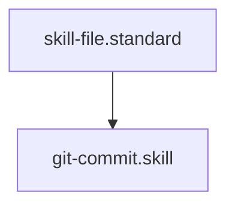

---
id: git-commit.skill
title: Git Hardened Commit
type: skill
tags: [git, version-control, automation, tool, action, execution]
interface:
  input: { message: "Commit message string" }
  output: { status: "success", message: "...", output: "..." }
implementation:
  engine: "python3 drivers/git/git_commit.py"
  command: "python3 drivers/git/git_commit.py '{{message}}'"
summary: Performs a hardened git commit with automated staging of all changes.
parent_standard: skill-file.standard
glossary_refs: [context.glossary]
---# Git Hardened Commit

## Context
Automates the "Stabilization" of the repository. Every commit must be accompanied by a descriptive message that adheres to the **Diamond Logic** versioning standards.

## Execution Steps
1. **Engine Invocation**: Run `git_commit.py` with the provided message.
2. **Post-Check**: Verify the commit hash and status in the output.

## Quality Gate
- **Verification**: The commit message must follow the `Type: Description (vX.X.X)` format.
- **Enforcement**: Commits without a valid message or with a failing status are **Unacceptable (U)**.

## Architecture

