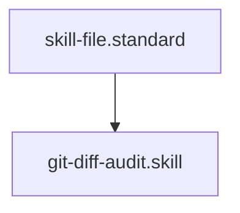

---
id: git-diff-audit.skill
title: PR Diff Auditor
type: skill
tags: [git, version-control, audit, review, tool, action, execution]
interface:
  input: { pr_branch: "branch-name", base_branch: "main" }
  output: { status: "success", changed_files: ["A new_file.md", "M old_file.md"] }
implementation:
  engine: "python3 drivers/git/git_diff_audit.py"
  command: "python3 drivers/git/git_diff_audit.py {{pr_branch}} {{base_branch}}"
summary: Audits the logical diff between a PR branch and the base branch using local git metadata.
parent_standard: skill-file.standard
glossary_refs: [context.glossary, skill.glossary]
---# PR Diff Auditor

## Context
Provides structural visibility into a PR's impact. This skill is used by the **Integrity Guardian** to verify that a PR doesn't introduce massive structural debt or violate repository standards.

## Execution Steps
1. **Sync**: Run `git-fetch.skill` to ensure local metadata is current.
2. **Engine Invocation**: Run `git_diff_audit.py` with the target branch.
3. **Analysis**: Inspect the list of modified files for architectural violations.

## Verification Protocol
1. Create a local branch with one modified file.
2. Run `python3 drivers/git/git_diff_audit.py [branch]`.
3. Verify the file is listed with the correct status (`M` or `A`).

## Quality Gate
- **Verification**: Output must list all changes between the two refs.
- **Enforcement**: Any PR modifying more than 10 files without an accompanying **Implementation Plan** is flagged for high-level SME review.

## Architecture

