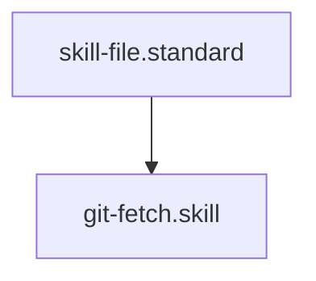

# Git Remote Auditor

## Context
Ensures the local repository is aware of the latest remote changes before any analysis, branching, or merging occurs.

## Execution Steps
1. **Engine Invocation**: Run `git_fetch.py`.
2. **Analysis**: Inspect the output for new branches or tags.

## Verification Protocol
1. Run `python3 drivers/git/git_fetch.py`.
2. Verify output indicates success or lists updated refs.

## Quality Gate
- **Verification**: Output must confirm synchronization with `origin`.
- **Enforcement**: Out-of-sync local metadata is a **Standard Violation (A)** for architectural consistency.

## Architecture

