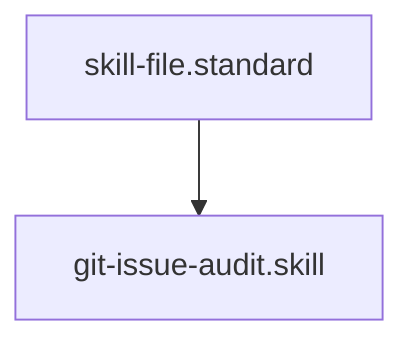

---
id: git-issue-audit.skill
title: GitHub Issue Auditor
type: skill
tags: [git, github, audit, review, tool, action, execution]
interface:
  input: { owner: "org", repo: "repo-name", issue_number: "123", token: "optional-token" }
  output: { status: "success",
title: "...", body: "...", labels: ["bug"] }
implementation:
  engine: "python3 drivers/git/github_issue_audit.py"
  command: "python3 drivers/git/github_issue_audit.py {{owner}} {{repo}} {{issue_number}} {{token}}"
summary: Fetches and analyzes GitHub issue metadata to ingest external feedback or bug reports.
parent_standard: skill-file.standard
glossary_refs: [context.glossary, instruction.glossary, skill.glossary, system-first-remediation.glossary]
---# GitHub Issue Auditor

## Context
Bridges the gap between the internal Kernel state and external feedback. This skill allows agents to ingest bug reports and translate them into systemic healing waves.

## Execution Steps
1. **Engine Invocation**: Run `github_issue_audit.py`.
2. **Triage**: Analyze the issue body and labels.
3. **Remediation**: Use `system-first-remediation.instruction` to address the root cause.

## Verification Protocol
1. Run `python3 drivers/git/github_issue_audit.py` on a known public issue.
2. Verify the title, body, and labels are correctly returned in JSON.

## Quality Gate
- **Verification**: Output must include `status`, `title`, and `body`.
- **Enforcement**: Mandatory step during "Bug Bash" or "Feedback Processing" workflows.

## Architecture

