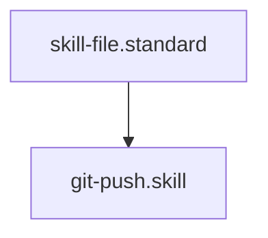

# Git Remote Synchronizer

## Context
The final step of any hardening wave. This skill ensures that the local "Diamond State" is persisted to the remote authority.

## Execution Steps
1. **Engine Invocation**: Run `git_push.py`.
2. **Analysis**: Inspect the output for connectivity issues or merge conflicts.

## Quality Gate
- **Verification**: Output must confirm successful push to `origin/main`.
- **Enforcement**: Persistent push failures must be escalated to the **Operator**.

## Architecture

## Verification Protocol
1. Run {
  "status": "fail",
  "message": "fatal: unable to access 'https://github.com/Gizmo4Life/ai-kernel.git/': Could not resolve host: github.com
"
}.
2. Verify remote reflects local changes.

## Verification Protocol
1. Run `python3 drivers/git/git_push.py`.
2. Verify remote reflects local changes.
