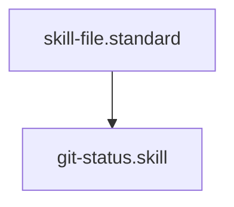

# Git Status Auditor

## Context
Standardizes the process of checking the repository's working state. This skill is a prerequisite for any automated commit or deployment workflow.

## Execution Steps
1. **Engine Invocation**: Run `git_status.py`.
2. **Analysis**: Inspect the list of modified files.
3. **Verification**: Ensure no sensitive or out-of-scope files are staged.

## Quality Gate
- **Verification**: Output must be valid JSON with a `status` field.
- **Enforcement**: Any "Dirty" working tree must be resolved before a Global Healing Wave.

## Architecture

## Verification Protocol
1. Run {
  "status": "success",
  "modified_files": [
    "M context/global-gap-report.md",
    "D drivers/auto_linker.py",
    "D drivers/connectivity_auditor.py",
    "D drivers/cycle_detector.py",
    "D drivers/doc_auditor.py",
    "D drivers/enforcement_tracker.py",
    "D drivers/fm_repair.py",
    "D drivers/global_compliance_auditor.py",
    "D drivers/global_diamond_healer.py",
    "D drivers/global_diamond_healer_v2.py",
    "D drivers/heal_v2.py",
    "D drivers/hierarchy_healer.py",
    "D drivers/id_auditor.py",
    "D drivers/master_healer.py",
    "D drivers/mermaid_gen.py",
    "D drivers/semantic_healer.py",
    "D drivers/similarity_auditor.py",
    "D drivers/standard_auditor.py",
    "D drivers/universal_standard_healer.py",
    "D drivers/update_scopes.py",
    "D drivers/visual_glossary_healer.py",
    "M skills/audit-repository-connectivity.skill.md",
    "M skills/auto-link-glossary.skill.md",
    "M skills/check-id-uniqueness.skill.md",
    "M skills/detect-circular-delegation.skill.md",
    "M skills/doc-audit.skill.md",
    "M skills/evaluate-against-standard.skill.md",
    "M skills/find-similar-terms.skill.md",
    "M skills/generate-mermaid-diagram.skill.md",
    "M skills/global-healing-wave.skill.md",
    "M skills/track-enforcement-posture.skill.md",
    "?? drivers/git/",
    "?? drivers/kernel/",
    "?? skills/git-commit.skill.md",
    "?? skills/git-push.skill.md",
    "?? skills/git-status.skill.md"
  ],
  "count": 36
}.
2. Verify JSON output contains .

## Verification Protocol
1. Run `python3 drivers/git/git_status.py`.
2. Verify JSON output contains `modified_files`.
