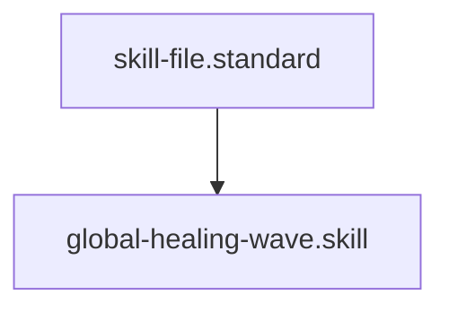

# Global Healing Wave

## Context
Individual audits and fixes are prone to "Logic Drift." This skill provides a single, atomic command to bring the entire AI Kernel into 100% compliance by coordinating our full suite of deterministic engines.

## Architecture

## Execution Steps
1. **Engine Invocation**: Run `master_healer.py`.
2. **Review**: Inspect the console output for success/failure of each step.
3. **Certification**: Verify the `context/global-gap-report.md` for final stability scores.

## Verification Protocol
1. Introduce a missing header in a skill.
2. Run `python3 engines/master_healer.py`.
3. Verify that the file is flagged in the final report.

## Quality Gate
- **Verification**: All steps must report `SUCCESS`.
- **Enforcement**: Mandatory step after any mass-refactor or before any major branch merge.
