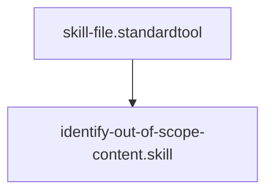

# Identify Out-of-Scope Content

## Context
This skill provides the "Sensing" logic for the De-conflation engine. It compares a file's content against its `type` (Standard, Skill, etc.) and flags any blocks that belong in a different domain.

## Architecture

## Execution Steps
1. **Domain Alignment Check**: Scan for content patterns that belong in other tiers.
    - **Skill Files**: Flag any multi-step "Workflows" or "Concept Definitions."
    - **Instruction Files**: Flag any "Atomic Tool Usage" or "Static Rules."
    - **Standard Files**: Flag any "Surgical Commands" or "Step-by-step Logic."
2. **SSOT Gap Analysis**: Check if the flagged content already exists in the target domain.
3. **Candidate Selection**: List all content blocks that require extraction.

## Verification Protocol
1. Input a Skill file containing a 5-paragraph glossary definition.
2. Verify the output flags the definition as "Out of Scope" for the Skill domain.
3. Verify the output correctly suggests the `glossary/` folder as the target.

## Quality Gate
- **Verification**: Detection must be based on the **Atomic Extraction Standard**.
- **Enforcement**: False positives (flagging core logic as out-of-scope) must be <5%.
