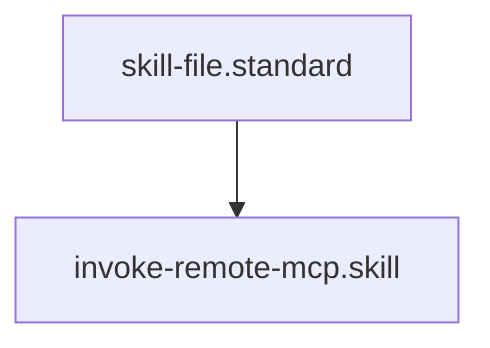

---
id: invoke-remote-mcp.skill
title: Remote MCP Actuator
type: skill
tags: [mcp, network, distributed, integration, tool, action, execution]
interface:
  input: { server_url: "http://...", tool: "name", arguments: {} }
  output: { status: "success", output: {} }
implementation:
  engine: "python3 drivers/mcp/mcp_query.py"
  command: "python3 drivers/mcp/mcp_query.py {{server_url}} {{tool}} '{{arguments}}'"
summary: Invokes a tool on a remote MCP server, enabling distributed governance across multiple project environments.
parent_standard: skill-file.standard
glossary_refs: [context.glossary, orchestration.glossary, skill.glossary, standard.glossary]
---# Remote MCP Actuator

## Context
High-scale ecosystems require governance that spans multiple repositories. This skill allows the AI Kernel to reach out to remote instances of itself (or other MCP servers) to execute cross-repo audits and healing waves.

## Execution Steps
1. **Target Selection**: Identify the `server_url` of the remote kernel.
2. **Tool Selection**: Choose the tool from the remote kernel's `tool-manifest.md`.
3. **Engine Invocation**: Run `mcp_query.py`.
4. **Integration**: Merge the remote audit results into the local context.

## Verification Protocol
1. Start the `kernel_server.py` locally.
2. Invoke `invoke-remote-mcp.skill` targeting `localhost:8080/tools/execute`.
3. Verify the remote `compliance_audit` output is received locally.

## Quality Gate
- **Verification**: Remote output must be valid JSON and adhere to the **Kernel Standard**.
- **Enforcement**: Mandatory skill for any **Multi-Project Orchestration** workflows.

## Architecture

